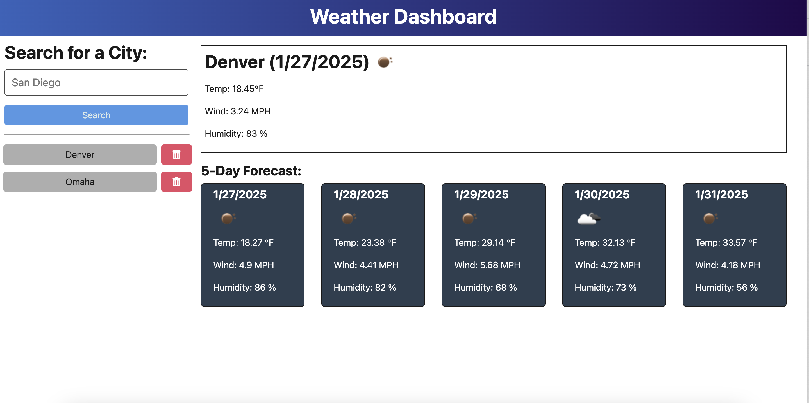

# Weather Dashboard

## Description
This is an application that uses the OpenWeather API to render data to a weather dashboard in the browser.

## Table of Contents
1. [Installation](#installation)
2. [Usage](#usage)
3. [Contributing](#contributing)
4. [Tests](#tests)
5. [License](#license)
6. [Questions](#questions)

## Installation
To install the application locally, do the following in your terminal:

1. Clone the repository to your local computer.  
   `git clone git@github.com:lwebert/Challenge-09.git`
2. Check that node.js is installed.  
   `node -v`
3. Install dependencies.  
   `npm i`

## Usage
To run the application locally, use the following command in your terminal: `npm run start:dev`.

You can also utilize the deployed application via the following link: 

## Contributing
This application was developed by Lauren Webert. Here are some guidelines on ways to contribute:

Report a bug fix.

1. Create a new Issue in the GitHub repo.

Make local changes to push up.

1. Create a new branch (`git checkout -b <your-feature-branch-name>`)
2. Make your changes locally
3. Push the code back to the GitHub repo (`git push origin <your-feature-branch-name>`)
4. Create a pull request to merge your changes

## Tests
The application is working correctly if are able to search for a city in the search bar, and the current weather, as well as the weather for the next 5 days, is shown in the browser. The city should be added to the side pannel of previously searched cities.

## License
The application is covered under [Apache License 2.0](https://www.apache.org/licenses/LICENSE-2.0.txt).   
https://www.apache.org/licenses/LICENSE-2.0.txt

## Questions
- GitHub username: [lwebert](https://github.com/lwebert).
- Reach me at [lauren@weberts.org](lauren@weberts.org) with additional questions.
